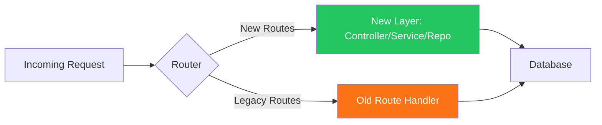
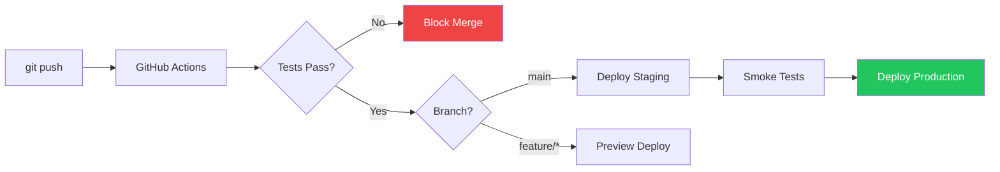

# Production Migration Plan

**Author:** Principal Software Engineer  
**Date:** July 2025  
**Applies To:** Inherited Legacy Codebase  
**Guiding Principle:** No big-bang rewrites. Every change ships incrementally with a clear rollback path.

---

## Core Philosophy

> "The goal is not to build the perfect system. The goal is to continuously improve a working system without breaking it."

Big-bang rewrites fail for three reasons:

1. **The feature gap problem:** The rewrite takes 6 months. The old system continues to evolve. By launch, the rewrite is already behind.
2. **The unknown-unknowns problem:** The old code, however ugly, encodes years of production learnings — edge cases, customer workarounds, and silent business rules. A rewrite discards all of them.
3. **The confidence problem:** Untested code has no baseline. You cannot prove the rewrite is correct because you have no test suite to compare against.

The strategy here is the **Strangler Fig Pattern**: incrementally replace components of the old system while keeping it fully operational. Each replaced piece is tested, deployed, and monitored before the next piece is touched.

---

## Migration Architecture



Old and new routes coexist behind the same Express application until migration is complete. There is no cutover day.

---

## Week 1 — Security Foundation

**Goal:** Eliminate all immediate attack surfaces. No feature work until this phase is complete.

### W1-D1: Credential Rotation

**Deliverables:**
- [ ] Rotate all database passwords
- [ ] Rotate all JWT secrets
- [ ] Rotate all third-party API keys
- [ ] Invalidate all existing user sessions (bump JWT secret)
- [ ] Verify old credentials are dead (attempt connection with old creds)

**Why Day 1:**  
Secrets in Git history are compromised from the moment they were committed. Until rotated, every engineer, contractor, and ex-employee who ever cloned the repository has production credentials.

**Risk:** New credentials may not be immediately propagated to all environments.  
**Rollback:** None needed — this is additive. Old credentials stop working; new ones take over.  
**Success Criteria:** `git log -S "<old_db_password>"` returns no results in current files. All services connect using new credentials.

---

### W1-D2–D3: Secrets Management

**Deliverables:**
- [ ] Create `.env.example` with all variable names, no values
- [ ] Add `.env` to `.gitignore` and verify it was never committed
- [ ] Run `git filter-repo --strip-blobs-bigger-than 0 --path .env` if `.env` exists in history
- [ ] Migrate production secrets to Render Environment Groups / AWS Secrets Manager
- [ ] Add `dotenv` package and load config from environment in all entry points
- [ ] Install `trufflehog` pre-commit hook

```bash
# .gitignore additions
.env
.env.*
!.env.example
*.pem
*.key
```

**Risk:** A developer may hard-code a credential in a rush during an incident.  
**Rollback:** Revert the commit that introduced the hard-coded value; rotate the exposed credential.  
**Success Criteria:** CI pipeline runs `trufflehog --no-update .` and fails on any detected secret.

---

### W1-D4: Input Validation

**Deliverables:**
- [ ] Install `zod` (or `joi`)
- [ ] Install `express-mongo-sanitize`
- [ ] Add payload size limit (`express.json({ limit: '10kb' })`)
- [ ] Write schemas for all existing mutating routes
- [ ] Add validation middleware that returns `400` with structured error on schema failure

**Why this week:**  
NoSQL injection via unvalidated `req.body` is trivially exploitable. `{ email: { "$gt": "" } }` returns all records in MongoDB. This takes under an hour to add and closes a critical attack vector.

**Risk:** Adding strict validation may break existing clients sending malformed data.  
**Mitigation:** Audit client payloads in staging before enforcing in production. Use `zod` with `.partial()` for initially lenient schemas, tighten over time.  
**Success Criteria:** `POST /api/leads` with `{ "email": {"$gt": ""} }` returns `400 Validation Error`, not data.

---

### W1-D5: Global Error Handler and Structured Logging

**Deliverables:**
- [ ] Add `pino` or `winston` with JSON output
- [ ] Attach `requestId` (UUID v4) to every request via middleware
- [ ] Add global Express error handler as last middleware
- [ ] Add `process.on('unhandledRejection')` handler
- [ ] Ensure `err.stack` is never sent to clients in production
- [ ] Ship logs to external service (Logtail, Datadog, or Papertrail)

```javascript
// Error handler shape (never exposes internals in production)
app.use((err, req, res, next) => {
  logger.error({ requestId: req.id, err, path: req.path });
  const statusCode = err.statusCode || 500;
  res.status(statusCode).json({
    success: false,
    error: {
      code: err.code || 'INTERNAL_ERROR',
      message: process.env.NODE_ENV === 'production'
        ? 'An unexpected error occurred'
        : err.message,
    },
  });
});
```

**Risk:** Swallowing errors that were previously visible (even if crudely).  
**Rollback:** Remove error handler middleware; revert to previous behavior in one line.  
**Success Criteria:** No stack traces visible in API responses. Every error appears in log aggregator with requestId.

---

## Month 1 — Architectural Stabilization

**Goal:** Make the codebase safe to modify. Engineers can ship features without fear.

### M1-W2: Service Layer Extraction

**Deliverables:**
- [ ] Create `services/` directory
- [ ] Move business logic from the 3 highest-traffic route handlers into service files
- [ ] Route handler becomes: parse → validate → call service → respond
- [ ] Old route handler kept as-is alongside new handler behind a feature flag

**Strategy — The Strangler Fig in Practice:**

```javascript
// BEFORE: Everything in the route handler
router.post('/leads', async (req, res) => {
  // 80 lines of mixed logic
});

// AFTER: Route handler is thin
router.post('/leads', authenticate, validate(leadSchema), leadController.create);

// leadController.create calls leadService.createLead
// leadService.createLead calls leadRepository.create
```

Start with the most-tested business flows, not the most complex ones. Move simple, stable functionality first to build confidence in the pattern.

**Risk:** Behavioral regression during extraction.  
**Rollback:** Feature flag routes new requests to old handler. Revert flag in < 5 minutes.  
**Success Criteria:** All moved routes have integration tests that pass before the legacy route is deleted.

---

### M1-W3: Repository Pattern

**Deliverables:**
- [ ] Create `repositories/` directory
- [ ] Move all Mongoose `.find()`, `.create()`, `.updateOne()` calls into repository files
- [ ] No Mongoose model is imported directly inside a service or controller
- [ ] Write unit tests for each repository method against an in-memory MongoDB (using `mongodb-memory-server`)

**Why this matters:**  
If the team ever needs to switch databases (Postgres, DynamoDB) or mock the data layer in tests, repositories are the only file that changes. Services and controllers are insulated.

**Risk:** Over-engineering early. Some repositories may be thin wrappers.  
**Mitigation:** Accept thin wrappers. The abstraction boundary is worth the verbosity.  
**Success Criteria:** `grep -r "mongoose.model" ./services` returns no results.

---

### M1-W4: Test Foundation

**Deliverables:**
- [ ] Install Jest + Supertest
- [ ] Write integration tests for every auth route (login, register, protected routes)
- [ ] Write integration tests for every RBAC rule (admin can delete; member cannot)
- [ ] Write integration tests for 2 core business flows (create lead, update status)
- [ ] Run tests in CI on every pull request

**Coverage Target (Month 1):**

| Area | Target |
|---|---|
| Auth routes | 100% |
| Authorization rules | 100% |
| Core lead CRUD | 80% |
| Overall backend | 40% |

**Risk:** Writing tests for untested code surfaces bugs. This is expected and not a reason to skip tests — it is the point of tests.  
**Rollback:** Tests are additive. They cannot break production.  
**Success Criteria:** `npm test` passes in CI before any pull request is merged.

---

### M1-W5: Authentication Hardening

**Deliverables:**
- [ ] Add rate limiting on auth routes (`express-rate-limit`: 5 attempts / 15 min)
- [ ] Add `helmet` for security headers
- [ ] Verify JWT `expiresIn` is set (no non-expiring tokens)
- [ ] Add `GET /auth/me` endpoint to validate token without database round-trip abuse
- [ ] Document token lifecycle in `EngineeringStandards.md`

**Risk:** Rate limiting may block legitimate users (e.g., batch integrations).  
**Mitigation:** Apply rate limiting to login only, not to token-bearing authenticated routes.  
**Success Criteria:** 6 consecutive failed login attempts returns `429 Too Many Requests`.

---

## Quarter 1 — Engineering Excellence

**Goal:** The codebase can now sustain a team of 10 engineers without constant firefighting.

### Q1-M2: CI/CD Pipeline



**Deliverables:**
- [ ] GitHub Actions workflow: lint → test → build → deploy
- [ ] Separate staging and production environments
- [ ] Automated smoke tests post-deployment
- [ ] Rollback workflow: re-deploy previous commit via GitHub Actions input

**Success Criteria:** Time from `git push` to production < 8 minutes for standard deploys.

---

### Q1-M2: Monitoring & Observability

**Deliverables:**
- [ ] Sentry error tracking on frontend and backend
- [ ] Render or AWS health check on `/health` endpoint
- [ ] Uptime monitoring with PagerDuty or BetterUptime
- [ ] Dashboard: error rate, P95 response time, DB query duration, active users

**Alerting Thresholds:**

| Metric | Warning | Critical |
|---|---|---|
| Error rate | > 1% | > 5% |
| P95 response time | > 500ms | > 2s |
| Uptime | < 99.9% | < 99% |
| Disk usage | > 70% | > 90% |

**Success Criteria:** Mean Time to Detection (MTTD) for production incidents < 5 minutes.

---

### Q1-M3: Caching and Performance

**Deliverables:**
- [ ] Add Redis for session caching and API response caching
- [ ] Cache dashboard aggregation queries (TTL: 30 seconds)
- [ ] Add database query indexes based on most frequent filter patterns
- [ ] Add `compression` middleware for gzip on all responses > 1KB
- [ ] Performance baseline: P50 < 50ms, P95 < 200ms for read endpoints

---

### Q1-M3: API Versioning

**Deliverables:**
- [ ] Move all routes to `/api/v1/*`
- [ ] Add `Deprecation` and `Sunset` headers on any route scheduled for removal
- [ ] Document versioning policy in `EngineeringStandards.md`
- [ ] Write API changelog starting from v1.0

**Risk:** Breaking change for existing API consumers.  
**Mitigation:** Run `/api/*` and `/api/v1/*` concurrently during a 3-month transition window. Log `/api/*` usage to identify un-migrated consumers.

---

## Rollback Decision Framework

| Scenario | Action | Time to Recover |
|---|---|---|
| New feature causes 500 errors | Re-deploy previous Git tag | < 5 min |
| Database migration causes data loss | Restore from automated backup | < 30 min |
| Security fix causes auth regressions | Feature flag off; patch and redeploy | < 15 min |
| Dependency upgrade breaks startup | Pin previous version; redeploy | < 10 min |
| Infrastructure failure | Failover to backup region (if configured) | < 60 min |

**Golden Rule:** Every deployment must be reversible. If a change cannot be rolled back in under 10 minutes, it needs a feature flag.

---

## Success Metrics by Phase

| Phase | Metric | Target |
|---|---|---|
| Week 1 | Secrets in codebase | 0 |
| Week 1 | Unvalidated mutating routes | 0 |
| Month 1 | Test coverage | > 40% |
| Month 1 | P0 bugs reaching production | < 1/month |
| Quarter 1 | Deploy frequency | > 5/week |
| Quarter 1 | MTTD for incidents | < 5 min |
| Quarter 1 | MTTR for incidents | < 30 min |
| Quarter 1 | P95 API response time | < 200ms |

---

*See `RefactorExample.md` for concrete before/after code transformations and `EngineeringStandards.md` for the ongoing development standards that prevent regression.*
